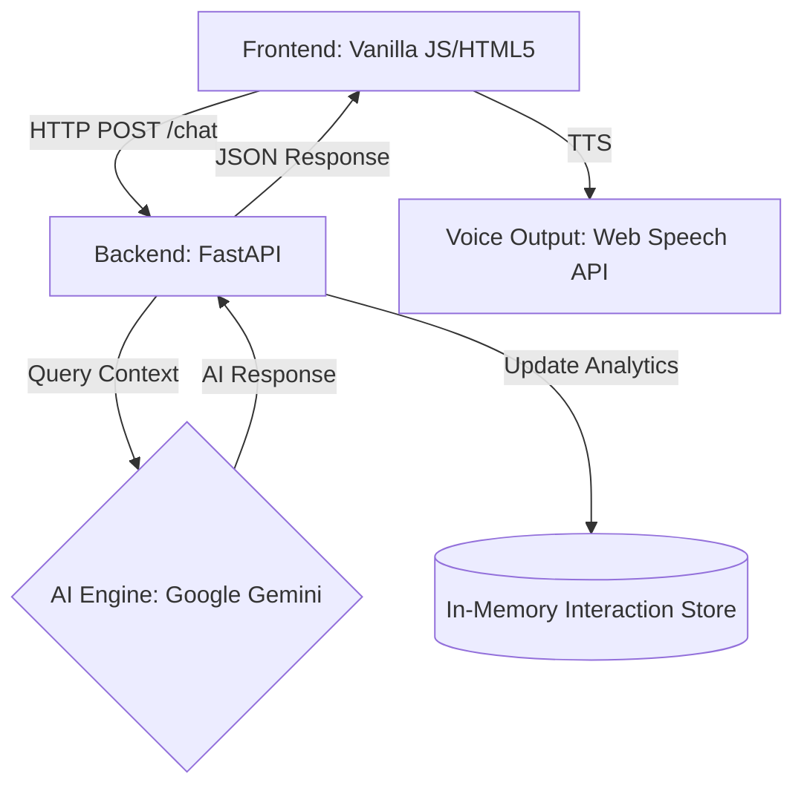

# 🤖 OmniServe AI – Professional Voice Customer Support Platform

[](https://github.com/rashedulalbab253/Customer_voice_agent/actions)
[](https://www.python.org/)
[](https://fastapi.tiangolo.com/)

**OmniServe AI** is a professional, context-aware **Voice Customer Support Platform** designed for real-time engagement. Built with **FastAPI**, **Google Gemini**, and a sleek **Enterprise Modern UI**, this system provides human-like interaction with persistent context and real-time analytics.

---

## 🏗️ Project Architecture

The system follows a modern decoupled architecture, ensuring scalability and ease of deployment:



### Components:
1.  **Frontend**: A modern, responsive interface using CSS Grid/Flexbox and Vanilla JS. It handles Voice-to-Text (STT) and Text-to-Voice (TTS) directly in the browser.
2.  **API Layer (FastAPI)**: A high-performance asynchronous API that handles request routing, static file serving, and analytics tracking.
3.  **AI Orchestrator**: Managed by `CustomerSupportAgent`, which injects system personas, manages user-specific message history, and interfaces with the Google Gemini API.
4.  **Analytics Tracking**: A dedicated module that captures performance metrics (response time, query length) and user activity.

---

## 🚀 Key Features

-   **🎙️ Voice-First Interaction**: Integrated Speech-to-Text for input and Text-to-Speech (TTS) for natural-sounding AI responses.
-   **🧠 Persistent Context**: Remembers conversation history for each user to maintain a coherent dialogue.
*   **🌐 Bengali & English Support**: Fully multilingual capabilities for both input and output.
-   **📈 Real-time Analytics**: Built-in dashboard to track total interactions, unique users, and average response times.
-   **💼 Enterprise Modern UI**: A clean, professional theme designed for corporate environments with Indigo accents and a polished layout.
-   **🧪 Synthetic Data**: Generate mock customer profiles (orders, history) on-the-fly to test AI capabilities.

---

## 🛠️ Tech Stack

-   **Language**: Python 3.12+
-   **Web Framework**: FastAPI
-   **AI Inference**: Google Gemini (Flash-latest)
-   **Frontend**: HTML5, CSS3 (Vanilla), JavaScript (ES6+)
-   **Voice**: Web Speech API
-   **Containerization**: Docker & Docker Compose

---

## 📦 Installation & Setup

### 1. Prerequisites
- Python 3.12+
- Google Gemini API Key ([Get it here](https://aistudio.google.com/))
- Docker Desktop (Optional)

### 2. Local Development
1.  **Clone the Repository**:
    ```bash
    git clone https://github.com/rashedulalbab253/Customer_voice_agent.git
    cd Customer_voice_agent
    ```
2.  **Configuration**:
    Create a `.env` file in the root directory:
    ```env
    GOOGLE_API_KEY=your_gemini_key_here
    ```
3.  **Environment Setup**:
    ```bash
    python -m venv env
    .\env\Scripts\activate
    pip install -r requirements.txt
    ```
4.  **Run the Application**:
    ```bash
    python run.py
    ```
    Visit: `http://localhost:8000`

### 3. Running with Docker
```bash
docker-compose up --build
```

---

## 👨‍💻 Author

**Rashedul Albab**
-   **Position**: Lead Developer
-   **Focus**: Full-Stack AI Engineering & Multimodal Conversational Systems
-   **GitHub**: [@rashedulalbab253](https://github.com/rashedulalbab253)

---

*© 2026 OmniServe AI. Developed with ❤️ by Rashedul Albab.*
