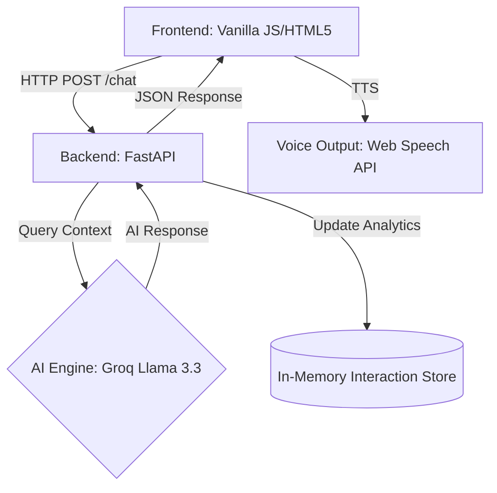

# 🤖 TechGadgets AI: Premium Customer Support Agent

[](https://github.com/rashedulalbab253/Customer_voice_agent/actions)
[](https://hub.docker.com/r/rashedulalbab1234/techgadgets-ai-agent)
[](https://www.python.org/)
[](https://fastapi.tiangolo.com/)

An industry-standard, voice-enabled AI support agent designed for premium e-commerce. Built with **FastAPI**, **Groq (Llama 3.3)**, and a sleek **Glassmorphism UI**, this system provides human-like interaction with persistent context and real-time analytics.

---

## 🏗️ Project Architecture

The system follows a modern decoupled architecture, ensuring scalability and ease of deployment:



### Components:
1.  **Frontend**: A modern, responsive interface using CSS Grid/Flexbox and Vanilla JS. It handles Voice-to-Text (STT) and Text-to-Voice (TTS) directly in the browser.
2.  **API Layer (FastAPI)**: A high-performance asynchronous API that handles request routing, static file serving, and analytics tracking.
3.  **AI Orchestrator**: Managed by `CustomerSupportAgent`, which injects system personas, manages user-specific message history, and interfaces with the Groq API.
4.  **Analytics Tracking**: A dedicated module that captures performance metrics (response time, query length) and user activity.

---

## 🚀 Key Features

-   **🎙️ Voice-First Interaction**: Integrated Speech-to-Text for input and Text-to-Speech (STT) for natural-sounding AI responses.
-   **🧠 Persistent Context**: Remembers the last 10 messages of each user to maintain a coherent conversation.
-   **📈 Real-time Analytics**: Built-in dashboard to track total interactions, unique users, and average response times.
-   **🎨 Premium UI**: A "Midnight Cyber" dark theme featuring glassmorphism effects, smooth CSS transitions, and responsive design.
-   **🧪 Synthetic Data**: Generate mock customer profiles (orders, history) on-the-fly to test AI capabilities.
-   **⚙️ CI/CD Ready**: Automated Docker image builds via GitHub Actions.

---

## 🛠️ Tech Stack

-   **Language**: Python 3.12+
-   **Web Framework**: FastAPI
-   **AI Inference**: Groq (Llama-3.3-70b-versatile)
-   **Frontend**: HTML5, CSS3 (Vanilla), JavaScript (ES6+)
-   **Voice**: Web Speech API
-   **Containerization**: Docker & Docker Compose
-   **CI/CD**: GitHub Actions

---

## 📦 Installation & Setup

### 1. Prerequisites
- python 3.12+
- Groq API Key ([Get it here](https://console.groq.com/))
- Docker Desktop (Optional)

### 2. Local Development
1.  **Clone the Repository**:
    ```bash
    git clone https://github.com/rashedulalbab253/Customer_voice_agent.git
    cd Customer_voice_agent
    ```
2.  **Configuration**:
    Create a `.env` file in the root directory:
    ```env
    GROQ_API_KEY=your_key_here
    ```
3.  **Environment Setup**:
    ```bash
    python -m venv env
    .\env\Scripts\activate
    pip install -r requirements.txt
    ```
4.  **Run the Application**:
    ```bash
    python run.py
    ```
    Visit: `http://localhost:8000`

### 3. Running with Docker
```bash
docker-compose up --build
```

---

## 🤖 CI/CD Pipeline

This project uses **GitHub Actions** to maintain a production-ready Docker image.

-   **Workflow**: `.github/workflows/docker-publish.yml`
-   **Process**: Every push to the `main` branch triggers an automated build that pushes the latest image to:
    `rashedulalbab1234/techgadgets-ai-agent:latest`

> **Note**: To use this workflow in your fork, add `DOCKER_USERNAME` and `DOCKER_PASSWORD` to your GitHub Repository Secrets.

---

## 📂 Project Structure

```text
├── .github/workflows/  # CI/CD pipelines
├── src/
│   ├── agent.py        # Core AI/Groq logic
│   ├── analytics.py    # Metrics tracking
│   ├── config.py       # Pydantic settings
│   └── utils.py        # Logging & helpers
├── static/             # Frontend assets (CSS/JS/HTML)
├── app.py              # Main API entry point
├── run.py              # Dev runner script
├── Dockerfile          # Container configuration
└── requirements.txt    # Python dependencies
```

---

## 👨‍💻 Author

**Rashedul Albab**
-   GitHub: [@rashedulalbab253](https://github.com/rashedulalbab253)
-   Docker Hub: [@rashedulalbab1234](https://hub.docker.com/u/rashedulalbab1234)
